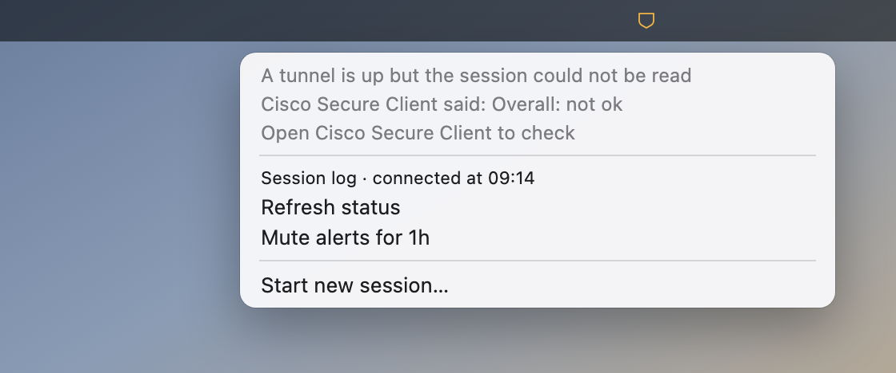

# vpn-eta

A macOS menu-bar shield for Cisco Secure Client, with the session countdown one click away.


<sub>Generated from the plugin's own output by [`docs/make-menu-image.sh`](docs/make-menu-image.sh).</sub>

Corporate gateways hand out sessions with a hard deadline — commonly 24 hours — and then drop
you mid-call or mid-`ssh`. Cisco does know the number: open its window and the status line
reads `01:06:47 (22 Hours 53 Minutes Remaining)`. But it is one window away, so you see it
only when you think to look, and it never says anything at fifteen minutes left.

The shield shows whether the session is healthy, changing or needs attention. Its menu shows
the remaining time, warns before it expires, logs how each session ended, and lets you start
or end one.

> **Scope:** macOS, Cisco Secure Client or AnyConnect. If your VPN is WireGuard, OpenConnect
> or Tailscale, this is not the tool — and those have good menu-bar apps already. They
> answer *am I connected?*, which you already know. This answers *how long have I got?*

## Requirements

- macOS. Built on macOS 15 / Apple Silicon; Intel and older macOS are untested.
- [Cisco Secure Client](https://www.cisco.com/c/en/us/products/security/secure-client/index.html)
  or AnyConnect, installed normally — its CLI comes along at `/opt/cisco/secureclient/bin/vpn`.
- [SwiftBar](https://swiftbar.app) **2.1.0+** — `brew install --cask swiftbar`. Older
  versions type the start command as simulated keystrokes, which breaks under a non-Latin
  keyboard layout; see [Troubleshooting](#troubleshooting).
- Apple's Swift command-line toolchain for immediate refresh after network changes.
  If it is absent, installation keeps the one-minute refresh and says so.

It runs Cisco's read-only `vpn stats` and `vpn hosts`, plus `vpn connect` / `vpn disconnect`
when you click the start or the disconnect item, `ifconfig` to see whether the tunnel is up,
and `osascript` / `open` to post a notification. No privileges, no network calls of its own, and it writes only
to its config file and its state directory.

## Install

```sh
git clone https://github.com/rakhimovv/vpn-eta.git && cd vpn-eta
./install.sh
```

It reads **your** saved profiles out of Cisco and asks which one to use, finds SwiftBar's
plugin folder, writes `~/.config/vpn-eta/config` at mode `0600`, and restarts SwiftBar. If
SwiftBar has no plugin folder yet it creates one and points SwiftBar at it — that and the
terminal choice are SwiftBar-wide preferences, shared with your other plugins.

Nothing about your VPN ships in this repository. Hostnames are read from the client on your
Mac at install time and written only to your own config. To see what it would find:

```sh
./install.sh --print-hosts    # prints your real gateway names — redact before pasting anywhere
./install.sh --yes --host vpn.example.com --label Work --terminal Ghostty    # scripted
```

Keep the clone — the plugin is copied out and does not need it at runtime, but
`./uninstall.sh` lives here.

## What you see

The menu bar holds one outline shield with no mark inside. Its colour changes with the state:

| Shield colour | Means |
|---|---|
| Neutral | Connected. The menu shows the precise remaining time and whether it is estimated. |
| Amber | Less than an hour remains, the connection is changing, or Cisco cannot confirm its state. Open the menu for details. |
| Grey | A reported disconnect, or no session *and* no tunnel. |
| Red | Less than fifteen minutes remain, a transition is stuck, login is delayed, or Cisco is missing. Open the menu for the reason. |

The installer adds a per-user watcher that requests a fresh Cisco read after a macOS network change.
The plugin also refreshes once a minute — the `1m` in the filename — for quiet changes.
The disconnected shield appears only on positive
evidence, never because a read failed: `vpn stats` can exit 0 without ever reaching Cisco's
daemon, and reporting that as a disconnect would make the indicator wrong exactly when you
are leaning on it.

Prefer a text countdown? Set `VPN_ETA_BAR_MODE=countdown`. In that mode,
`VPN_ETA_LABEL` changes its prefix and `VPN_ETA_COMPACT=1` drops the minutes while over an hour
is left.

In the wrong place? Hold ⌘ and drag the item to move it along the menu bar — that is macOS,
not this plugin, so it works on any status item and the position sticks.

## Configuration

`~/.config/vpn-eta/config`, a shell fragment — `NAME=value`, one per line. Every option and
its default is in [`config.example`](config.example).

A file rather than your shell profile because SwiftBar starts plugins from launchd, which
reads no `~/.zshrc`. A variable exported there reaches a terminal run and never the menu bar.

| Setting | Default | What it does |
|---|---|---|
| `VPN_ETA_HOST` | the only saved profile | Which profile the start item connects to. Needed only with more than one. Takes a name or a URL. |
| `VPN_ETA_BAR_MODE` | `icon` | Set `countdown` to show the older text menu-bar item. |
| `VPN_ETA_LABEL` | `VPN` | Prefix for the optional text countdown. `""` removes it. |
| `VPN_ETA_COMPACT` | unset | In text mode, drop minutes while over an hour is left. Rounds down. |
| `VPN_ETA_CRITICAL_MINUTES` | `15` | Shield turns red at or below this. |
| `VPN_ETA_WARN_MINUTES` | `60` | Shield turns amber at or below this. |
| `VPN_ETA_NOTIFY_MARKS` | `60 15` | Minutes left that raise a notification. `""` switches them off. |
| `VPN_ETA_MUTE_MINUTES` | `60` | How long one click of `🔕 Mute alerts` lasts. `0` removes the item. |
| `VPN_ETA_STATE_DIR` | SwiftBar's per-plugin data dir | Where the state file and `history.log` live. |
| `VPN_ETA_HISTORY_LINES` | `500` | How much history to keep. |
| `VPN_ETA_VPN_BIN` | autodetected | The Cisco CLI, if it is not at a standard path. |
| `VPN_ETA_AUTO_CONNECT` | off | Reconnect after Cisco explicitly reports `Disconnected`. |
| `VPN_ETA_USER` | unset | AD login used by automatic reconnection. |
| `VPN_ETA_AUTO_RETRY` | `300` | Minimum seconds between automatic login attempts. |
| `VPN_ETA_KEYCHAIN_SERVICE` | `vpn-eta` | Keychain item prefix; use a different value for a second VPN token. |
| `VPN_ETA_KEYCHAIN_TIMEOUT` | `10` | Seconds allowed for each Keychain read during automatic login. |
| `VPN_ETA_TIMEOUT` | `12` | Seconds to wait for one CLI call. |
| `VPN_ETA_STALE_LIMIT` | `45` | Minutes an extrapolated countdown stays trustworthy. |
| `VPN_ETA_TRANSITION_LIMIT` | `5` | Minutes one reconnect may run before it counts as stuck rather than settling. `0` never escalates. |
| `VPN_ETA_TEARDOWN_GRACE` | `300` | Seconds after your own teardown during which a drop is not announced. |
| `VPN_ETA_INCIDENT_LOG` | off | On a reconnect, drop or unreadable reply, save the client's own log for the previous 15 minutes into `incidents/` beside `history.log`. |
| `VPN_ETA_INCIDENT_KEEP` | `20` | How many captures to keep. The oldest are deleted, so the directory has a ceiling rather than a growth rate. |
| `VPN_ETA_CONNECT_ATTEMPTS` | `15` | How many times to poll a new session for its countdown. |
| `VPN_ETA_CONNECT_SLEEP` | `2` | Seconds between those polls. |

**Two gateways at once.** Copy the plugin under a second name; each copy reads
`<its own name>.config` and falls back to the shared one.

```sh
plugins=$(defaults read com.ameba.SwiftBar PluginDirectory)
cp swiftbar/vpn-eta.1m.sh "$plugins/vpn-eta-lab.1m.sh"
printf "VPN_ETA_HOST='lab.example.com'\nVPN_ETA_LABEL='Lab'\n" > ~/.config/vpn-eta/vpn-eta-lab.config
```

A manually copied second plugin keeps the one-minute schedule; the installer adds the
network watcher for its main `vpn-eta` plugin only. Use `VPN_ETA_BAR_MODE=countdown` in
the second config if you want its menu-bar icon to carry a distinguishing label.

## Starting and ending a session

`🔑 Start new session…` reconnects your configured profile in a terminal window, because
Cisco asks for a password, usually a one-time code too, and there is nowhere else to type them.
Which terminal is SwiftBar's setting — Preferences → Advanced → Terminal, or
`./install.sh --terminal Ghostty`.

The click is the confirmation, so nothing more is asked when the VPN is already down. Only a
live session about to be torn down gets `Continue? [Y/n]`, where Enter means yes.

By default, vpn-eta does not handle your VPN credentials. Cisco asks for them in the terminal.

`⛔ Disconnect` ends the session and appears only while there is one to end. No terminal
window opens: ending a session asks Cisco for nothing, and the sign-in is what *starting* one
costs. The teardown is recorded as one you asked for, so it raises no drop alert — the menu
bar simply goes to `off`. If Cisco refuses, a notification says so, since nothing on that path
has a window to print to.

### Automatic reconnection

This optional mode starts a new session after Cisco **explicitly reports** `Disconnected`.
It does not disconnect a live session early, and it does not treat a silent client or a
`Reconnecting` state as permission to start another login. Scheduled attempts are spaced at least
five minutes apart; an explicit Retry starts one attempt immediately. If a login fails,
automatic connection pauses and sends a notification
instead of repeatedly trying a potentially bad token. While disconnected, the menu offers
`🔑 Connect automatically (Keychain)` or `↻ Retry automatic login (Keychain)`; that action
uses the same guarded login path immediately, even after a pause. It never tears down a
connected or reconnecting session. While connected, `▶ Resume automatic reconnection`
only arms future attempts. Choosing `⛔ Disconnect` pauses automatic reconnection.
At the start of an automatic attempt, SwiftBar sends a `VPN connecting` notification
and the shield turns amber. `Refresh status` reads the latest
recorded stage and seconds elapsed, even if Cisco temporarily cannot return
session statistics. A successful sign-in sends a
`VPN connected` notification; a failed one names the reason and pauses retries.
After 75 seconds without a result, the shield turns red and the menu says `login delayed…` rather than
silently looking idle. A progress marker older than five minutes expires.
The separate `🔑 Start manually (SMS or TOTP)…` item opens Cisco's
normal sign-in, so SMS remains a fallback if the saved TOTP token or automatic
login fails. It does not read Keychain; SMS codes still need to be entered by hand.
Choosing manual login pauses automatic reconnection until you resume it from the menu.

It uses the PIN and **secret key** of your VPN TOTP token. The secret key is the long value
you added to KeePassXC, not the six-digit code that changes every 30 seconds.

First set these lines in `~/.config/vpn-eta/config`, replacing both placeholders with your
own AD login and existing saved profile name:

```sh
VPN_ETA_HOST='your-saved-profile'
VPN_ETA_USER='your.ad.login'
VPN_ETA_AUTO_CONNECT=1
```

Then store the PIN and secret key in macOS Keychain. The plugin looks both items up under
the `VPN_ETA_USER` login, so the commands below read it from the config rather than asking
you to type it again; they prompt for each value without putting it in the command line.
Run them yourself and do not paste the values into the repo or a message:

```sh
u=$(. ~/.config/vpn-eta/config && printf %s "$VPN_ETA_USER") && [ -n "$u" ] &&
security add-generic-password -U -a "$u" -s vpn-eta-pin -w &&
security add-generic-password -U -a "$u" -s vpn-eta-totp -w
```

For a second gateway with a different token, set `VPN_ETA_KEYCHAIN_SERVICE` in that
plugin's config and store its items under `<value>-pin` and `<value>-totp`.

The plugin uses macOS's `security`, `expect` and Perl utilities to read the two Keychain
items only at Cisco's password prompt, generate a fresh TOTP code, and submit the combined
PIN and code. Credentials are never written to vpn-eta's config, state files or log.
KeePassXC does not need to be running for this mode. Anyone who can read those Keychain
items while your Mac is unlocked can generate the same login response, so enable this
only if that local access trade-off is acceptable to you. If Cisco changes its login
prompts, automatic login fails closed; you can still use `🔑 Start manually (SMS or TOTP)…`.
The automatic path has been tested against simulated prompts and one live Cisco
Secure Client 5.1.14.145 session on macOS. Verify it on your gateway before
relying on it for unattended work.
The latest attempt's non-secret stages are kept in `auto-attempt` beside `history.log`
(mode `0600`); they show whether Cisco reached the username prompt, Keychain was read,
and the client accepted or rejected the login. The menu shows the pause reason after
an unsuccessful attempt. Neither file contains the PIN, TOTP key or generated code.

## Notifications and the log

A notification at 60 and again at 15 minutes left, then one if the tunnel drops on its own, and
one if a reconnect will not settle — a Wi-Fi handover takes seconds, so five minutes of
`Reconnecting` is a session to start again rather than one to wait out.
Each mark fires once per session, so a Mac that slept through both wakes to one warning
rather than a stack. Tearing the session down yourself is not announced. SwiftBar has to be
allowed to send notifications once (System Settings → Notifications → SwiftBar).

`🔕 Mute alerts for 1h` silences both the warnings and the drop alert while the countdown
carries on as usual — for a talk, or a demo, or an hour you have already decided to spend
signing back in. A mark crossed while muted counts as delivered, so lifting the mute hands
over no backlog. The mute always expires, and `🔔 Resume alerts` lifts it early; one that
never lifted itself is how you would miss the fifteen-minute warning a week later.
`VPN_ETA_MUTE_MINUTES` sets the span, and `0` takes the item off the menu — to switch the
warnings off for good, empty `VPN_ETA_NOTIFY_MARKS` instead.

Every change of state appends one line to `history.log` — nothing while the state holds, so a
per-minute plugin does not fill a log with "still up". `🕘 Session log` opens it.

```
2026-08-24T20:11:48+0300	disconnected	state=Disconnected last_remaining=1290m
```

Those timestamps make Cisco's own account findable: `log show --start "2026-08-24 20:00:00"
--predicate 'process == "vpnagentd"'` names the reason outright. Use the full
`/usr/bin/log` — in zsh, `log` alone is a builtin that quietly does something else.

That account does not keep, and it is the client's own lines that go first. Measured on one Mac
inside a single evening: the same query over one midday window printed hundreds of lines at 19:00
and a single line by 23:00 — while `dasd` and `WindowServer` messages from that identical minute
were still there in full, and the store as a whole still reached back thirteen days. macOS ages
messages out on a schedule of its own and the VPN client's are on a short one, so the history line
survives and the reason behind it does not. Set `VPN_ETA_INCIDENT_LOG=1` and each reconnect, drop
or unreadable reply saves its previous fifteen minutes into `incidents/` beside `history.log`,
keeping the newest `VPN_ETA_INCIDENT_KEEP` and deleting the rest.

## Troubleshooting

**Start typed gibberish, or opened in the current tab.** SwiftBar before 2.1.0 drives Ghostty
with simulated keystrokes, which go through your current keyboard layout — under a non-Latin
one (Russian, Greek, Hebrew) the command arrives transliterated and the shell says `command
not found`. `brew upgrade --cask swiftbar`.

**Nothing in the menu bar.** SwiftBar must be running and pointed at the folder `install.sh`
printed. Check it against Preferences → General → Plugin Folder.

**Red shield with "Cisco Secure Client not found" in the menu.** Set `VPN_ETA_VPN_BIN`.

**"Cisco Secure Client has N saved profiles".** Set `VPN_ETA_HOST` — the message lists the
profiles and the exact line to add.

**Amber shield with "A tunnel is up but the session could not be read".**



The `vpn` binary is there
and something is bound to a `utun`, but the client would not say what. The line under it is
the client's own reply, and it is the one to read: `did not answer within 12s` is a watchdog
firing, anything after `said:` is Cisco's own account. Run
`/opt/cisco/secureclient/bin/vpn stats` yourself for the rest of it: 5.1.14 opens with an audit
of its own launchd jobs, where a VPN service that never came up says so — on a working install
`LaunchDaemon(com.cisco.secureclient.vpn.service.agent.plist) status:` reads `enabled` and
`vpnagentd` is running. That is Cisco's to repair, not the plugin's. The other cause is that
the tunnel is not Cisco's at all but another client's — Tailscale and WireGuard each bind a
`utun` of their own — in which case there is no Cisco session to count down and the reading is
correct.

**No notifications.** System Settings → Notifications → SwiftBar.

**The session log looks empty after upgrading SwiftBar.** SwiftBar decides where each plugin
keeps its data, and that path has changed between versions, so the old history is still on
disk under the previous path rather than gone. Set `VPN_ETA_STATE_DIR` to pin it somewhere
SwiftBar does not choose.

## Uninstall

```sh
./uninstall.sh          # remove the plugin, ask about the config and the history
./uninstall.sh --all    # remove all of it, ask nothing
```

A second copy installed for another gateway is not found automatically. SwiftBar's own
preferences are left as they were, since other plugins may now depend on them.
If you enabled automatic reconnection, the two Keychain items were added by you rather
than the installer and remain after uninstall. Remove them with `security
delete-generic-password -a '<your AD login>' -s vpn-eta-pin` and the same command
with `vpn-eta-totp` as the service name. If you changed
`VPN_ETA_KEYCHAIN_SERVICE`, use that prefix in both commands.

## Development

```sh
swiftbar/vpn-eta.1m.sh --version    # also works on the installed copy
tests/vpn-eta.test.sh               # the plugin — no VPN, no SwiftBar, no network
tests/install.test.sh               # install.sh and uninstall.sh
python3 docs/make-shield-icons.py   # rebuild the embedded shields (requires Inkscape)
docs/make-menu-image.sh             # regenerate the picture above
```

Both suites and ShellCheck run in CI on every push.
[`CONTRIBUTING.md`](CONTRIBUTING.md) has the house rules, [`SECURITY.md`](SECURITY.md) what
the tool does and does not touch, [`CHANGELOG.md`](CHANGELOG.md) what changed.

## License

MIT © 2026 Ruslan Rakhimov
