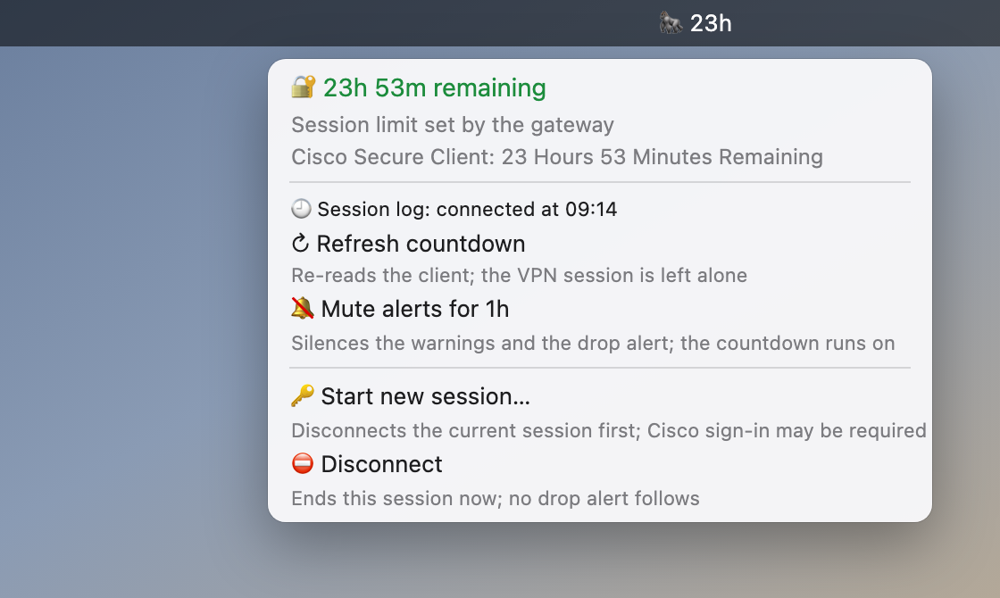

# vpn-eta

A macOS menu-bar countdown for the Cisco Secure Client session limit, with warnings before it
runs out.



<sub>Generated from the plugin's own output by [`docs/make-menu-image.sh`](docs/make-menu-image.sh).</sub>

Corporate gateways hand out sessions with a hard deadline — commonly 24 hours — and then drop
you mid-call or mid-`ssh`. Cisco does know the number: open its window and the status line
reads `01:06:47 (22 Hours 53 Minutes Remaining)`. But it is one window away, so you see it
only when you think to look, and it never says anything at fifteen minutes left.

This puts that number in the menu bar, notifies you before it expires, logs how each session
ended, and ends or starts one from a menu item.

> **Scope:** macOS, Cisco Secure Client or AnyConnect. If your VPN is WireGuard, OpenConnect
> or Tailscale, this is not the tool — and those have good menu-bar apps already. They
> answer *am I connected?*, which you already know. This answers *how long have I got?*

## Requirements

- macOS. Built on macOS 15 / Apple Silicon; Intel and older macOS are untested.
- [Cisco Secure Client](https://www.cisco.com/c/en/us/products/security/secure-client/index.html)
  or AnyConnect, installed normally — its CLI comes along at `/opt/cisco/secureclient/bin/vpn`.
- [SwiftBar](https://swiftbar.app) **2.1.0+** — `brew install --cask swiftbar`. Older
  versions type the start command as simulated keystrokes, which breaks under a non-Latin
  keyboard layout; see [Troubleshooting](#troubleshooting).

It runs Cisco's read-only `vpn stats` and `vpn hosts`, plus `vpn connect` / `vpn disconnect`
when you click the start or the disconnect item, `ifconfig` to see whether the tunnel is up,
and `osascript` / `open` to post a notification. No privileges, no network calls of its own, and it writes only
to its config file and its state directory.

## Install

```sh
git clone https://github.com/rakhimovv/vpn-eta.git && cd vpn-eta
./install.sh
```

It reads **your** saved profiles out of Cisco and asks which one to use, finds SwiftBar's
plugin folder, writes `~/.config/vpn-eta/config` at mode `0600`, and restarts SwiftBar. If
SwiftBar has no plugin folder yet it creates one and points SwiftBar at it — that and the
terminal choice are SwiftBar-wide preferences, shared with your other plugins.

Nothing about your VPN ships in this repository. Hostnames are read from the client on your
Mac at install time and written only to your own config. To see what it would find:

```sh
./install.sh --print-hosts    # prints your real gateway names — redact before pasting anywhere
./install.sh --yes --host vpn.example.com --label Work --terminal Ghostty    # scripted
```

Keep the clone — the plugin is copied out and does not need it at runtime, but
`./uninstall.sh` lives here.

## What you see

| Menu bar | Means |
|---|---|
| `VPN 6h 20m` | Cisco reported this just now. Green; orange under an hour, red under fifteen minutes. |
| `VPN 2h 44m` | Same number, extrapolated — the client went quiet but its tunnel is still bound. The menu says "estimated" and how old the reading is. |
| `VPN …` | Connecting, reconnecting or disconnecting. The deadline is carried across; a reconnect is not a session ending. |
| `VPN on` | Connected, no countdown reported. Some gateways send none. |
| `VPN ?` | A tunnel is up but unreadable — or Cisco Secure Client is missing. |
| `VPN off` | A reported disconnect, or no session *and* no tunnel. |

It refreshes once a minute — the `1m` in the filename. `off` appears only on positive
evidence, never because a read failed: `vpn stats` can exit 0 without ever reaching Cisco's
daemon, and reporting that as a disconnect would make the indicator wrong exactly when you
are leaning on it.

Too wide? `VPN_ETA_LABEL="🦍"` or `""` shortens the front, and `VPN_ETA_COMPACT=1` drops the
minutes while over an hour is left — `🦍 6h` instead of `VPN 6h 20m`.

In the wrong place? Hold ⌘ and drag the item to move it along the menu bar — that is macOS,
not this plugin, so it works on any status item and the position sticks.

## Configuration

`~/.config/vpn-eta/config`, a shell fragment — `NAME=value`, one per line. Every option and
its default is in [`config.example`](config.example).

A file rather than your shell profile because SwiftBar starts plugins from launchd, which
reads no `~/.zshrc`. A variable exported there reaches a terminal run and never the menu bar.

| Setting | Default | What it does |
|---|---|---|
| `VPN_ETA_HOST` | the only saved profile | Which profile the start item connects to. Needed only with more than one. Takes a name or a URL. |
| `VPN_ETA_LABEL` | `VPN` | Text before the countdown. An emoji is narrowest; `""` removes it. |
| `VPN_ETA_COMPACT` | unset | Drop the minutes while over an hour is left. Rounds down. |
| `VPN_ETA_CRITICAL_MINUTES` | `15` | Countdown turns red at or below this. |
| `VPN_ETA_WARN_MINUTES` | `60` | Countdown turns orange at or below this. |
| `VPN_ETA_NOTIFY_MARKS` | `60 15` | Minutes left that raise a notification. `""` switches them off. |
| `VPN_ETA_MUTE_MINUTES` | `60` | How long one click of `🔕 Mute alerts` lasts. `0` removes the item. |
| `VPN_ETA_STATE_DIR` | SwiftBar's per-plugin data dir | Where the state file and `history.log` live. |
| `VPN_ETA_HISTORY_LINES` | `500` | How much history to keep. |
| `VPN_ETA_VPN_BIN` | autodetected | The Cisco CLI, if it is not at a standard path. |
| `VPN_ETA_TIMEOUT` | `12` | Seconds to wait for one CLI call. |
| `VPN_ETA_STALE_LIMIT` | `45` | Minutes an extrapolated countdown stays trustworthy. |
| `VPN_ETA_TEARDOWN_GRACE` | `300` | Seconds after your own teardown during which a drop is not announced. |
| `VPN_ETA_CONNECT_ATTEMPTS` | `15` | How many times to poll a new session for its countdown. |
| `VPN_ETA_CONNECT_SLEEP` | `2` | Seconds between those polls. |

**Two gateways at once.** Copy the plugin under a second name; each copy reads
`<its own name>.config` and falls back to the shared one.

```sh
plugins=$(defaults read com.ameba.SwiftBar PluginDirectory)
cp swiftbar/vpn-eta.1m.sh "$plugins/vpn-eta-lab.1m.sh"
printf "VPN_ETA_HOST='lab.example.com'\nVPN_ETA_LABEL='Lab'\n" > ~/.config/vpn-eta/vpn-eta-lab.config
```

## Starting and ending a session

`🔑 Start new session…` reconnects your configured profile in a terminal window, because
Cisco asks for a password, usually a one-time code too, and there is nowhere else to type them.
Which terminal is SwiftBar's setting — Preferences → Advanced → Terminal, or
`./install.sh --terminal Ghostty`.

The click is the confirmation, so nothing more is asked when the VPN is already down. Only a
live session about to be torn down gets `Continue? [Y/n]`, where Enter means yes.

**It does not store your VPN password and has nowhere to put one.** A gateway with a second
factor issues a fresh code every login, so you are at the keyboard regardless. Cisco already
remembers your username; the password comes from your password manager.

`⛔ Disconnect` ends the session and appears only while there is one to end. No terminal
window opens: ending a session asks Cisco for nothing, and the sign-in is what *starting* one
costs. The teardown is recorded as one you asked for, so it raises no drop alert — the menu
bar simply goes to `off`. If Cisco refuses, a notification says so, since nothing on that path
has a window to print to.

## Notifications and the log

A notification at 60 and again at 15 minutes left, then one if the tunnel drops on its own.
Each mark fires once per session, so a Mac that slept through both wakes to one warning
rather than a stack. Tearing the session down yourself is not announced. SwiftBar has to be
allowed to send notifications once (System Settings → Notifications → SwiftBar).

`🔕 Mute alerts for 1h` silences both the warnings and the drop alert while the countdown
carries on as usual — for a talk, or a demo, or an hour you have already decided to spend
signing back in. A mark crossed while muted counts as delivered, so lifting the mute hands
over no backlog. The mute always expires, and `🔔 Resume alerts` lifts it early; one that
never lifted itself is how you would miss the fifteen-minute warning a week later.
`VPN_ETA_MUTE_MINUTES` sets the span, and `0` takes the item off the menu — to switch the
warnings off for good, empty `VPN_ETA_NOTIFY_MARKS` instead.

Every change of state appends one line to `history.log` — nothing while the state holds, so a
per-minute plugin does not fill a log with "still up". `🕘 Session log` opens it.

```
2026-08-24T20:11:48+0300	disconnected	state=Disconnected last_remaining=1290m
```

Those timestamps make Cisco's own account findable: `log show --start "2026-08-24 20:00:00"
--predicate 'process == "vpnagentd"'` names the reason outright. Use the full
`/usr/bin/log` — in zsh, `log` alone is a builtin that quietly does something else.

## Troubleshooting

**Start typed gibberish, or opened in the current tab.** SwiftBar before 2.1.0 drives Ghostty
with simulated keystrokes, which go through your current keyboard layout — under a non-Latin
one (Russian, Greek, Hebrew) the command arrives transliterated and the shell says `command
not found`. `brew upgrade --cask swiftbar`.

**Nothing in the menu bar.** SwiftBar must be running and pointed at the folder `install.sh`
printed. Check it against Preferences → General → Plugin Folder.

**`VPN ?` with "Cisco Secure Client not found".** Set `VPN_ETA_VPN_BIN`.

**"Cisco Secure Client has N saved profiles".** Set `VPN_ETA_HOST` — the message lists the
profiles and the exact line to add.

**No notifications.** System Settings → Notifications → SwiftBar.

**The session log looks empty after upgrading SwiftBar.** SwiftBar decides where each plugin
keeps its data, and that path has changed between versions, so the old history is still on
disk under the previous path rather than gone. Set `VPN_ETA_STATE_DIR` to pin it somewhere
SwiftBar does not choose.

## Uninstall

```sh
./uninstall.sh          # remove the plugin, ask about the config and the history
./uninstall.sh --all    # remove all of it, ask nothing
```

A second copy installed for another gateway is not found automatically. SwiftBar's own
preferences are left as they were, since other plugins may now depend on them.

## Development

```sh
swiftbar/vpn-eta.1m.sh --version    # also works on the installed copy
tests/vpn-eta.test.sh               # the plugin — no VPN, no SwiftBar, no network
tests/install.test.sh               # install.sh and uninstall.sh
docs/make-menu-image.sh             # regenerate the picture above
```

Both suites and ShellCheck run in CI on every push.
[`CONTRIBUTING.md`](CONTRIBUTING.md) has the house rules, [`SECURITY.md`](SECURITY.md) what
the tool does and does not touch, [`CHANGELOG.md`](CHANGELOG.md) what changed.

## License

MIT © 2026 Ruslan Rakhimov
